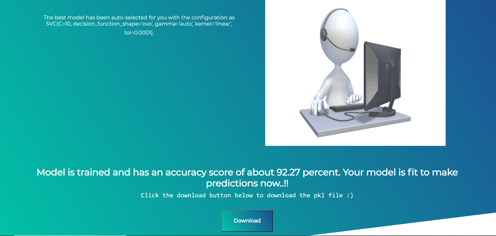

# Auto-ML-Toolkit
Data Science is an inter-disciplinary field that uses scientific methods, processes, algorithms and systems to extract knowledge and insights from many structural and unstructured data. Data science is related to data mining, machine learning and big data. Data science is a concept to unify statistics, data analysis and their related methods in order to understand and analyze actual phenomena with data. It uses techniques and theories drawn from many fields within the context of mathematics, statistics, computer science, domain knowledge and information science.

A challenge faced by Data scientists is the strict timeline and tough schedules. This makes way for the scope of an application that can work as an auto-ML app and do most of the tasks by itself and yet, involve the data scientist at each step for modifications. The paper describes an approach with some applications of the web-app that is a demo to the whole idea proposed above.<b> This web-application plots correlation matrices of features that lays a foundation for auto-feature selection and then trains the models over the data-set using a predefined template that, plots a comparison table of the models and performs automated model training and provides the best model fit to make predictions.</b>

For classification tasks, the metrics has been selected as 'roc_auc' while that for regression tasks is 'r2' score.

#### Tech Stack used
Front-end : HTML, CSS, Bootstrap\
Backend : Django

 ## Screenshots
 ##### Homepage
 
 
 ##### Upload csv file and choose type of task
 
 
 ##### Heatmap + Auto selection of features
 
 
  ##### Comparative performance of all models
 
 
   ##### Comparative graph
 
 
   ##### Selection of best model
 
 
   ##### Contact Us
 
 
 *For more images of the website checkout the screenshots folder.*

